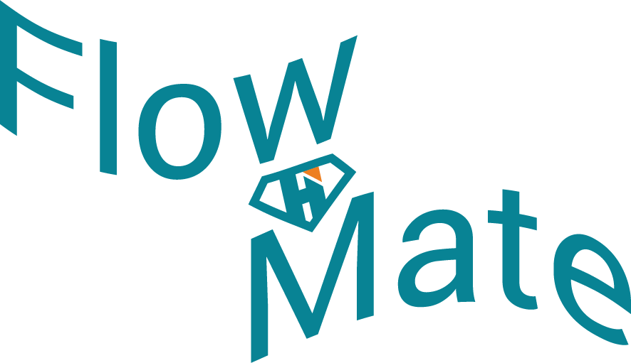

# FlowMate

Did you ever wondered how to keep all input to output correlations of a web application in mind during a pentest? With **FlowMate** you don't have to any longer. **FlowMate** is our BurpSuite extension that brings taint analysis to web applications, by tracking all parameters send to a target application and matches their occurrences in the responses. It works from a black-box or grey-box perspective not requiring any modifications to the underlying infrastructure or application itself. Furthermore, it creates a visual graph of all parameters in the background. Anytime you need to get more detailed information on a particular parameter, value or URL you can consult the built-in Neo4J browser to access the graph. With a single query in the Neo4J browser or via the built-in query view.

## Key Features
Some key features of FlowMate are:
- Track parameter values of all applications added to the BurpSuite project scope.
- Store all data points in a local and file-based Neo4J instance.
- Integrates the Neo4J Browser directly to visualize and browse the resulting graph. No installation needed.
- Enables you to define *Sessions* within the plugin to ease tracking cross-session parameters.
- Performs automatic audit steps on the created graph to generate Findings with points of interest.

## How to Use
**FlowMate** is used best during the reconnaissance phase in a security assessment. The following steps explain on how to get started:
1. Load FlowMate into your BurpSuite with a project for your current assessment already created
2. After loading finished add the target application to the BurpSuite internal *Scope*. Only in-scope targets are tracked by FlowMate
3. Activate the detection by checking both boxes on the *Getting Started* tab of FlowMate
4. Browse the application following the *General best practices* below
5. Stop the detection before starting manual analysis. This prevents payloads and duplicate values from polluting the graph.
6. Profit from the data flow graph created for you!

### What can you get from the graph?
1. You can lookup in which locations an specific parameter you are testing reappers in the application including the near sourrounding of the match giving a first impression on which payloads might be useful for exploitation
2. You can more easily identify occurrences of a parameter in not directly visible places, such as in hidden input fields or when a value is used in resources like stylesheets or scripts for example
3. In conjunction with the session tracking feature you can track cross-session parameter occurrences. In case of attack vectors like Cross-Site Scripting (XSS) this may lead to attacks on higher privileged accounts (privilege escalation, account takeover)
4. If your target application consits of multiple domains, for example APIs and the actual web frontend, the graph helps to detect cross-domain occurrences of parameter matches
5. You can identify unsafe behavior of the application directly from the graph. Some examples here are:
    - A user password is included in the applications sources in cleartext
    - Security enhancements such as CSRF tokens are not changed in a secure manner

### General best practices
- Enter *unique* and *long enough* values (generally more than 6 characters) when browsing an application with FlowMate enabled
- Do not enter payloads during this phase
- Browse all user roles and functionality availalbe

## Installation

1. Use the latest pre-built jar file from the *Releases* section
2. Clone the repository, switch into it and run `mvn package`. The `target` folder than contains a built version of FlowMate

